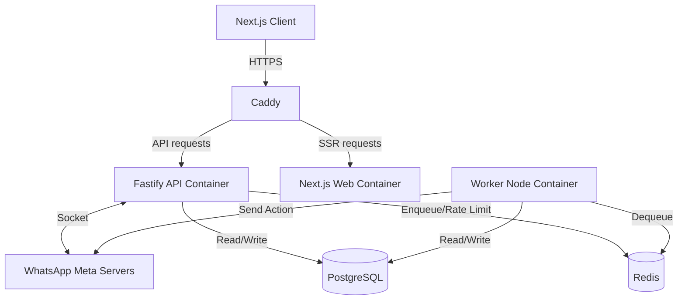
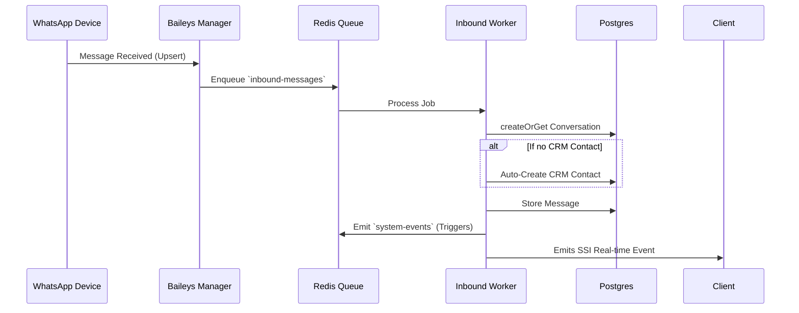
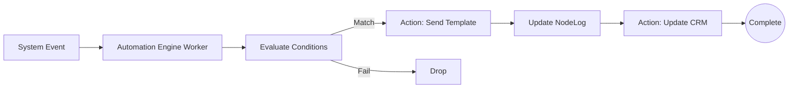

# WHATSVUE — SYSTEM ARCHITECTURE & DEVELOPMENT STATUS REPORT

## SECTION 1 — Project Overview

**What Whatsvue is:**
Whatsvue (internally styled as *Whatsvue*) is an AI-native WhatsApp CRM and Automation SaaS platform natively designed for high-throughput messaging, multi-agent support, and workflow automation.

**The problem it solves:**
Businesses struggle to maintain centralized control over their WhatsApp communication safely while scaling up. Whatsvue provides a secure, multi-tenant environment where entire teams can manage contacts, run broadcast campaigns, build responsive AI workflows, and collaborate on a single WhatsApp Business/Personal number without risking account bans or data silos.

**The SaaS model:**
It uses a B2B SaaS Multi-Tenant architectural model:
- **Workspaces:** Represent individual company tenants.
- **Role-Based Access Control (RBAC):** Users belong to workspaces as `OWNER`, `ADMIN`, `MEMBER`, or `VIEWER`.
- **Subscription/Plans:** Each workspace has a `plan` field tracking limits (e.g., Free, Pro, Enterprise).

**Core features currently implemented:**
- Multi-device WhatsApp Session connections (via QR).
- Real-time inbox and conversations system with media handling.
- CRM (Contacts, Organizations, Sales Pipelines).
- Campaigns (Bulk broadcasting of templates to CRM contacts).
- Automation Engine (FlowBuilder for multi-step triggers and logic).
- WhatsApp Message Templates and Quick Replies.

**Target users:**
- **Dealers & Sales Teams:** Managing pipelines, customer inquiries, and lead categorization.
- **CRM Operators/Support Agents:** Resolving tickets via the shared inbox.
- **Automation Builders:** Developing sophisticated macro responses and integration flows.

---

## SECTION 2 — Monorepo Structure

The codebase is organized as a Modern PNPM Workspace Monorepo, dividing duties distinctly across apps and shared packages.

- `apps/api/`: The Fastify & Node.js backend system. Contains the REST API routes, Baileys socket managers, Prisma database client, and BullMQ worker processes.
- `apps/web/`: The Next.js 14 frontend dashboard. Contains the React UI, Framer Motion animations, Zustand state, and React Flow builders.
- `packages/`: (Implied `workspace:*`) Shared dependencies. Includes `@whatszor/shared` for cross-boundary types, schemas, and configurations.
- `config files`: Root environment variables, `pnpm-workspace.yaml`, Docker orchestrations (`docker-compose.prod.yml`, `docker-compose.dev.yml`), and Caddy reverse proxy configs.

**Responsibility:** 
- The **API** provides stateless business logic APIs and stateful socket connections to WhatsApp.
- The **Web** handles user interaction, routing, and real-time SSE consumption. 
- The **Workers** (spun up from API codebase) handle queued background tasks separately.

---

## SECTION 3 — Backend Architecture

The backend is built on **Fastify** to maximize throughput and minimize overhead, strongly typed with TypeScript. It is orchestrated out of `server.ts`.

**API Modules:**
- **Auth Module:** Handles JWT generation/refresh and user login validations.
- **CRM Module:** Provides strict CRUD interfaces for Contacts, Deals, Stages, and Pipeline management.
- **Campaign Module:** Drafts broadcasts, selects templates, manages scheduling, and enqueues tasks.
- **Automation Module:** Manages the CRUD of `AutomationRule`s. Triggered events are matched against these rules to enqueue actions.
- **WhatsApp Module:** Contains the singleton `WhatsAppManager` wrapping `@itsukichan/baileys`. Extensively handles QR generation, Socket initialization, and `baileys-antiban` health-monitoring.
- **Media Module:** Safely uploads, streams, and proxies binaries (audio, images, docs) to/from WhatsApp and Local/S3 storage providers.
- **Template Module:** Interacts with Meta/Baileys to synchronize and issue message templates.
- **Queue Workers:** Dedicated scripts (like `automation-worker.ts`) executing isolated logic for `SYSTEM_EVENTS` payloads.

**Redis & BullMQ Usage:**
Redis plays two vast roles: Rate Limiting state for Fastify, and powering BullMQ.
BullMQ is structured into several isolated queues:
- `inbound-messages`: Wraps raw `messages.upsert` sockets.
- `outbound-messages`: Pulls jobs representing API sends, applying Gaussian jitter and anti-ban throttling via SafeSockets before sending.
- `automation`: Orchestrates flow graph ticks.
- `history-sync`: Handles massive bulk inserts from WhatsApp's historical backlog.
- `contacts-sync`: Syncs localized device contact names to overriding generic JIDs.

**Job Lifecycle:**
Events enter via a Baileys hook → A payload is pushed to a Queue → A Node.js Worker consumes it → Processes DB conditions (Prisma) → Triggers side-effects (e.g. `systemEventsQueue.add()`) → Finalizes status.

---

## SECTION 4 — Database Architecture

The schema is maintained in **Prisma** (PostgreSQL) focusing intensely on Tenant Isolation (`workspace_id`).

**Tables & Relationships:**
- **Workspaces & Users:** Joined by `WorkspaceMember` holding the `UserRole`.
- **CRM:** `Contact`, `Organization`, `Pipeline`, `Stage`, `Record`. All mapped via `workspaceId`. `Records` connect to `Stages` and `Contacts`.
- **Conversations & Messages:** `Conversation` represents a chat thread (JID) per Workspace. `Message` holds JSONB `mediaData`, statuses (`SENT`, `READ`, `FAILED`), and directionality.
- **Campaigns:** `Campaign` -> `CampaignMember` -> links to the `Message` generated for accurate bounce/fail analytics.
- **Automations:** `AutomationRule` captures logic flows natively in JSON (`flowDefinition`, `actions`). Generates `AutomationExecution` rows which keep cursor state (`currentStep`) while running, logging into `NodeExecutionLog`.
- **Media:** `Media` maps abstract keys to CDNs or local drives.

**Multi-workspace Design & Data Isolation:**
Prisma models universally possess `workspaceId`. All APIs derive the `workspaceId` not from the client payload natively, but from the server-validated JWT `(req.user.workspaceId)`, actively preventing Cross-Tenant Data Leakage via deterministic `where: { workspaceId }` filtering.

---

## SECTION 5 — Automation Engine

**React Flow Architecture & Node Types:**
The UI renders visual automation macros via `@xyflow/react`. Nodes vary by purpose: Triggers (e.g., "On Message Received", "On Tag Added") and Actions (e.g., "Send Template", "Add Delay", "Update CRM Record"). The edge structure chains the sequence.

**Execution Engine (`automation-worker.ts`):**
1. **Trigger:** `systemEventsQueue` pushes an event (e.g., inbound message).
2. **Matching:** Engine finds active `AutomationRule`s matching the `eventType`.
3. **Execution Record:** A `AutomationExecution` row is spawned.
4. **Step-by-Step:** The worker loops through the `rule.actions` JSON array.
5. If it encounters a "SEND_TEMPLATE" node, it parses liquid variables `{{contact.firstName}}` taking state from `execution.context`.
6. Enqueues an `outbound-messages` job. Advances `currentStep: i + 1`. Completes.

**Flow Storage:**
Saved seamlessly into `AutomationRule.flowDefinition` (for visual recovery) and `AutomationRule.actions/conditions` (for flattened engine execution).

---

## SECTION 6 — WhatsApp Infrastructure

**Integration Engine:** 
Built around `@itsukichan/baileys` (an active Baileys fork). State is maintained via a highly customized adapter (`usePrismaAuthState`), streaming Keys and PreKeys straight to the PostgreSQL `WhatsAppSession` table avoiding filesystem locking issues in Docker.

**Pipeline Flow:**
1. **Device Connection:** User requests pairing. API spins up `makeWASocket()`.
2. **QR Flow:** Baileys emits a base64 QR. It is relayed to the frontend. Device scans.
3. **Session Persistence:** State emits are instantly cached into Postgres. On pod restart, `restoreAllSessions()` reconstructs sockets seamlessly in memory.
4. **Outbound Pipeline & Anti-ban:** Instead of firing text directly down the raw socket, the API adds it to `outbound-messages`. A worker pops it, grabs the `safeSocket` wrapper (`baileys-antiban`), which imposes:
   - typing presence emulation
   - Gaussian jitter delay (1.5 - 5 seconds)
   - New-chat penalty limits.

Automations & Campaigns interact natively by merely dropping tasks into the universal `outbound-messages` queue rather than invoking sockets themselves.

---

## SECTION 7 — Frontend Architecture

Next.js 14 App Router dashboard built purely with React Server Components, Tailwind CSS, and Framer Motion.

**Routing Structure:**
Contained strictly within `app/(dashboard)/*` to inherit the authenticated layout:
- `/conversations` (The Live Messaging Inbox UI)
- `/contacts` (CRM Interface with Table views and slide-out panels)
- `/campaigns` (Wizard to select templates and push broadcasts)
- `/automations` (React Flow visual node editor)
- `/templates` & `/media` (Asset library galleries)

**State & Components:**
- **Auth State:** Decoded JWT context controls access. 
- **RBAC:** Gatekeeping renders layout options (e.g., `VIEWER` gets no "Settings" tab).
- **Zustand:** Powers global transient states like the currently active conversation tab without drill-down props.
- Data fetching driven heavily by React Query (`@tanstack/react-query`) for stale-while-revalidate caching.

---

## SECTION 8 — Observability & Production Systems

**Logging:** Powered by `pino` for rapid NDJSON logging and `pino-pretty` for dev readouts. HTTP requests are context-bound with a UUID.
**Sentry:** Deeply integrated (`@sentry/node` & `@sentry/nextjs`). Node Profiling Integration captures stack traces natively on crashes.
**Health Endpoints:** Isolated `/health` REST path, protected via `x-health-secret` so Docker orchestrators check liveness safely without exposing stats publically.
**Error Handling:** A unified `errorHandler.ts` catches Boom exceptions and Prisma errors, standardizing them into a strict `{ success: false, error: { code, message } }` output.
**Production Behavior:** Workers gracefully survive connection crashes. Reverse proxies handle SSL. Queues keep the API wildly responsive under massive WhatsApp sync loads.

---

## SECTION 9 — Deployment Architecture

The entire stack is containerized and orchestrated via `docker-compose.prod.yml`.

**Containers/Topology:**
- `caddy`: Reverse Proxy handing ACME SSL and forwarding `api` and `web` traffic.
- `web`: Next.js production server.
- `api`: Fastify backend REST server.
- `worker`: Same image as API, but entrypoint is `start-worker.ts` consuming queues.
- `db`: PostgreSQL 15.
- `redis`: Redis 7.

**CI/CD Pipeline:** Uses GitHub infrastructure. Commits trigger linting/typechecking. The repository leverages `.github/workflows` (implied) to assert tests, build, and deploy to Hostinger VPS limits securely.

---

## SECTION 10 — Security Model

- **Authentication:** Custom JWT access tokens (short lifespan) with secure HttpOnly Refresh Cookies.
- **JWT Handling:** Stored server-side in `RefreshToken` tables for immediate remote revocation.
- **RBAC:** Enforced intrinsically via middleware validating if `user.role` meets required permissions on specific routes.
- **Rate Limiting:** IP and Workspace based. Configured critically into Redis (`max: 300` per minute). Derived from Server `req.user` context, never from client headers.
- **API Protection:** Fastify Helmet configures CORS cleanly restricting XSS headers. Protected behind a central Auth gatekeeper.

---

## SECTION 11 — Current Feature Status

| Feature | Status | Notes |
|---------|--------|-------|
| Multi-tenant Workspaces | **Completed** | Full tenant isolation intact. |
| CRM (Contacts) | **Completed** | Migration hooks for LIDs implemented. |
| Campaign System | **Partially Implemented** | Backend wizard flow exists, UI wizard active. |
| Automations Engine | **Partially Implemented** | React Flow UI + Worker scaffold exists. Needs action expansion. |
| WhatsApp Messaging | **Completed** | Full sync, multi-status receipts, anti-ban wrappers operational. |
| Media System | **Partially Implemented** | Inbound works. Local storage. Needs S3 integration bridging. |
| RBAC / Member Mgmt | **Completed** | Guard middleware actively bounds user scopes. |
| Template System | **Partially Implemented** | Skeleton exists, reliant on WhatsApp Business verification state. |
| AI Chatbot / Generators | **Planned** | Gemini endpoints scouted. Needs integration hooks into Inbox worker. |

---

## SECTION 12 — Known Technical Debt

1. **Automation Worker Scaffold:** Currently executes linear arrays. Full true-graph backward tracing for complex multi-branch forks needs rigid testing.
2. **Missing Input Validations:** Certain Next.js forms need deeper `Zod` coercion integration to match Fastify safety logic.
3. **Queue Monitor UI:** No visible dashboard (e.g. BullMQ board) exists yet for admin observation of stalled history-sync jobs.
4. **Scalability Risks:** Storing media binaries purely locally via Docker Volumes will eventually exhaust disk space. Hardcut migration to `STORAGE_PROVIDER=s3` is heavily urged.
5. **Code Duplication:** Some UI components in the CRM dashboard overlap in logic regarding table-fetching.

---

## SECTION 13 — Future Development Roadmap

1. **AI Automation Assistant:** Train a fine-tuned Gemini model to dynamically assemble `flowDefinition` JSON blocks from natural language prompts ("Create a flow that replies to pricing queries and tags them").
2. **Message Queues Optimization:** Introduce Priority queueing (e.g., Live Agent replies skip over Bulk Campaign blasts).
3. **Multi-workspace Scaling:** Horizontally shard the WhatsApp WebSocket manager into specialized microservices independent from typical REST API load.
4. **Analytics:** Introduce a dedicated aggregated metrics pipeline tracking campaign open/read drops accurately over time.
5. **Automation Marketplace:** Central catalog allowing users to share and install pre-built `AutomationTemplate` artifacts.

---

## SECTION 14 — System Diagrams

### 1. High-Level Architecture

### 2. Message Processing Pipeline

### 3. Automation Flow Execution

---

## SECTION 15 — Recommended Next Milestones

- **Phase 16 — Infrastructure Stabilization:** Transition media uploads fully to S3. Harden Docker rebuild processes natively. Setup external PostgreSQL DB clustering.
- **Phase 17 — Automation Engine Hardening:** Flesh out complex Branch/Delay node types. Build out UI simulators handling mock payload simulations flawlessly.
- **Phase 18 — AI Chatbot Module:** Hook Gemini stream responses automatically into unassigned inbox threads.
- **Phase 19 — Analytics & Reporting:** Track throughput. Build visual recharts tracking team metrics.
- **Phase 20 — Enterprise Scaling:** Move Baileys socket execution out of the main API monolith to prevent memory bloat on heavy video syncing occurrences. 

_This document accurately represents the exact logical structure of the Whatsvue application environment at the current branch state._
